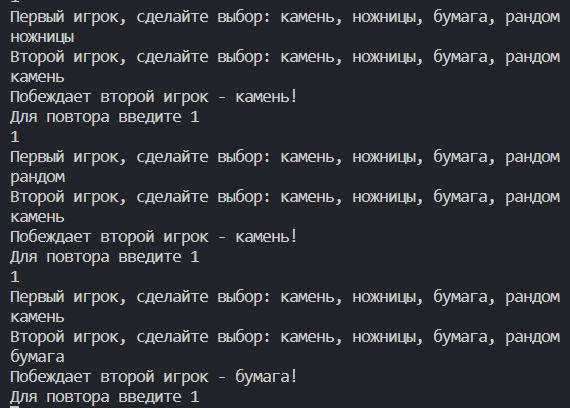

# Практическая работа №3. Выполнила Сафрыгина Анастасия
## Стратегия
``` python
import random
from abc import ABC, abstractmethod

class Variant(ABC):
    @abstractmethod
    def selection(self) -> None:
        pass
class stone(Variant):
    def selection(self) -> str:
        return "камень"
class scissors(Variant):
    def selection(self) -> str:
        return "ножницы"
class paper(Variant):
    def selection(self) -> str:
        return "бумага"

class Random(Variant):
    def selection(self) -> str:
        options = [ "камень", "ножницы", "бумага"]
        return random.choice(options)

class Game:
    strategy: Variant
    def __init__(self, strategy: Variant = None) -> None:
        if strategy is not None:
            self.strategy = strategy
        else:
            self.strategy = Random()
    def play(self, sec2) -> None:
        s1 = self.strategy.selection()
        s2 = sec2.strategy.selection()
        if s1 == s2:
            print("Победила дружба!")
        elif s1 == "камень":
            if s2 == "бумага":
                print("Побеждает второй игрок - бумага!")
            elif s2 == ("ножницы"):
                print("Побеждает первый игрок - камень!")
        elif s1 == "ножницы":
            if s2 == "бумага":
                print("Побеждает первый игрок - ножницы!")
            elif s2 == ("камень"):
                print("Побеждает второй игрок - камень!")
        elif s1 == "бумага":
            if s2 == "камень":
                print("Побеждает первый игрок - бумага!")
            elif s2 == ("ножницы"):
                print("Побеждает второй игрок - ножницы!")

def playtime(vibor):
    if vibor == "камень":
        return Game(stone())
    elif vibor == "ножницы":
        return Game(scissors())
    elif vibor == "бумага":
        return Game(paper())
    elif vibor == "рандом":
        return Game(Random())
n=1
while n==1:
    print("Первый игрок, сделайте выбор: камень, ножницы, бумага, рандом")
    vibor=input()
    while vibor not in ("камень", "ножницы", "бумага", "рандом"):
        print("Невверный ввод, выберите из списка выше:")
        vibor=input()
    player1 = playtime(vibor)
    
    print("Второй игрок, сделайте выбор: камень, ножницы, бумага, рандом")
    vibor = input()
    while vibor not in ("камень", "ножницы", "бумага", "рандом"):
        print("Невверный ввод, выберите из списка выше:")
        vibor=input()
    player2 = playtime(vibor)
    player1.play(player2)
    print("Для повтора введите 1")
    n=int(input())
print("конец!")
```

