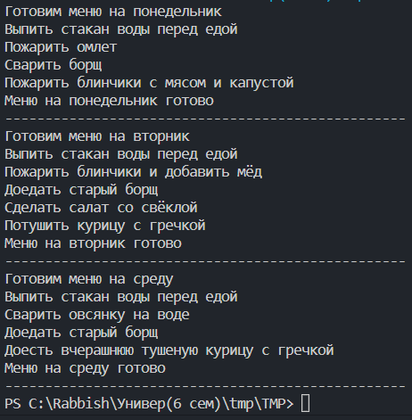

# Практическая работа №3. Выполнила Сафрыгина Анастасия
## Стратегия
``` python
import random
from abc import ABC, abstractmethod

class Variant(ABC):
    @abstractmethod
    def selection(self) -> None:
        pass
class stone(Variant):
    def selection(self) -> str:
        return "камень"
class scissors(Variant):
    def selection(self) -> str:
        return "ножницы"
class paper(Variant):
    def selection(self) -> str:
        return "бумага"

class Random(Variant):
    def selection(self) -> str:
        options = [ "камень", "ножницы", "бумага"]
        return random.choice(options)

class Game:
    strategy: Variant
    def __init__(self, strategy: Variant = None) -> None:
        if strategy is not None:
            self.strategy = strategy
        else:
            self.strategy = Random()
    def play(self, sec2) -> None:
        s1 = self.strategy.selection()
        s2 = sec2.strategy.selection()
        if s1 == s2:
            print("Победила дружба!")
        elif s1 == "камень":
            if s2 == "бумага":
                print("Побеждает второй игрок - бумага!")
            elif s2 == ("ножницы"):
                print("Побеждает первый игрок - камень!")
        elif s1 == "ножницы":
            if s2 == "бумага":
                print("Побеждает первый игрок - ножницы!")
            elif s2 == ("камень"):
                print("Побеждает второй игрок - камень!")
        elif s1 == "бумага":
            if s2 == "камень":
                print("Побеждает первый игрок - бумага!")
            elif s2 == ("ножницы"):
                print("Побеждает второй игрок - ножницы!")

def playtime(vibor):
    if vibor == "камень":
        return Game(stone())
    elif vibor == "ножницы":
        return Game(scissors())
    elif vibor == "бумага":
        return Game(paper())
    elif vibor == "рандом":
        return Game(Random())
n=1
while n==1:
    print("Первый игрок, сделайте выбор: камень, ножницы, бумага, рандом")
    vibor=input()
    while vibor not in ("камень", "ножницы", "бумага", "рандом"):
        print("Невверный ввод, выберите из списка выше:")
        vibor=input()
    player1 = playtime(vibor)
    
    print("Второй игрок, сделайте выбор: камень, ножницы, бумага, рандом")
    vibor = input()
    while vibor not in ("камень", "ножницы", "бумага", "рандом"):
        print("Невверный ввод, выберите из списка выше:")
        vibor=input()
    player2 = playtime(vibor)
    player1.play(player2)
    print("Для повтора введите 1")
    n=int(input())
print("конец!")
```


## Шаблонный метод
``` python
from abc import ABC, abstractmethod


class Algorithm(ABC):

    def template_method(self):

        self.water()
        self.breakfast()
        self.dinner()
        self.supper()
        self.final()
        self.printer()

    def water(self):
        print("Выпить стакан воды перед едой")

    @abstractmethod
    def breakfast(self):
        pass

    @abstractmethod
    def dinner(self):
        pass

    @abstractmethod
    def supper(self):
        pass

    def final(self):
        print('Меню на три дня готово!')

    def printer(self):
        n = 50
        print("-" * n)
class menu:
    def omelet(self):
        print("Пожарить омлет")

    def pancakes(self):
        print("Пожарить блинчики и добавить мёд")

    def oatmeal(self):
        print("Сварить овсянку на воде")

    def borsch(self):
        print("Сварить борщ")

    def yesterday_borsch(self):
        print("Доедать старый борщ")

    def pancakes_meat(self):
        print("Пожарить блинчики с мясом и капустой")

    def salad_beets(self):
        print("Сделать салат со свёклой")

    def chicken_buckwheat(self):
        print("Потушить курицу с гречкой")

    def eggs(self):
        print("Пожарить яичницу")

    def toast(self):
        print("Сделать тост с авкоадо и форелью")

    def banana(self):
        print("Съесть банан")

    def molochka(self):
        print("Смешать творог со сметаной")

    def chicken_buckwheat_yes(self):
        print("Доесть вчерашнюю тушеную курицу с гречкой")

class Monday(Algorithm):
    def breakfast(self):
        z = menu()
        z.omelet()

    def dinner(self):
        z = menu()
        z.borsch()

    def supper(self):
        z = menu()
        z.pancakes_meat()

    def final(self):
        print('Меню на понедельник готово')

class Tuesday(Algorithm):
    def breakfast(self):
        z = menu()
        z.pancakes()

    def dinner(self):
        z = menu()
        z.yesterday_borsch()

    def supper(self):
        z = menu()
        z.salad_beets()
        z.chicken_buckwheat()

    def final(self):
        print('Меню на вторник готово')

class Wednesday(Algorithm):
    def breakfast(self):
        z = menu()
        z.oatmeal()

    def dinner(self):
        z = menu()
        z.yesterday_borsch()

    def supper(self):
        z = menu()
        z.chicken_buckwheat_yes()

    def final(self):
        print('Меню на среду готово')

print("Готовим меню на понедельник")
a=Monday()
a.template_method()

print("Готовим меню на вторник")
b=Tuesday()
b.template_method()

print("Готовим меню на среду")
c=Wednesday()
c.template_method()
```
